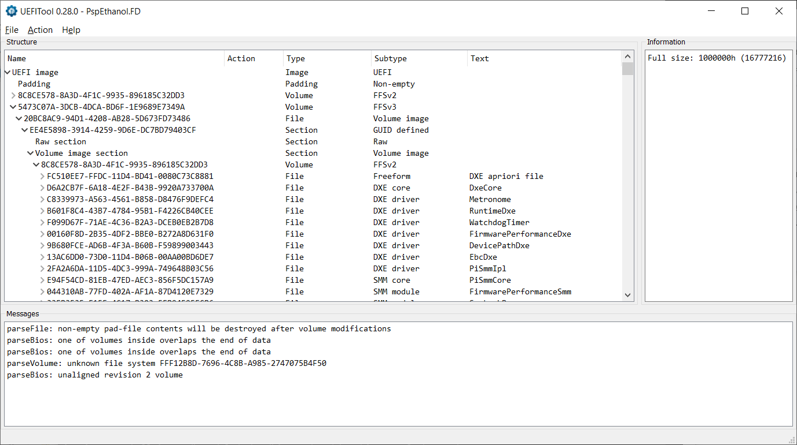
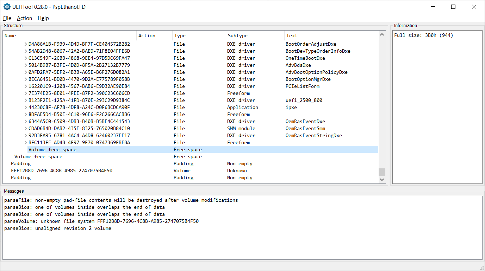

# Description

This folder contains fully independent `DXE_DRIVER` implementation that can be compiled with the modern [EDK2](https://github.com/tianocore/edk2). Instead of using some IPMI protocol from the BIOS vendor, this implementation has a fully working IPMI KCS transfer code. Besides the `DXE_DRIVER` this folder also contains an `UEFI_APPLICATION` to test the code in the UEFI Shell.

# Building with EDK2

First install necessary packages to your distro.
For the EDKII compilation you'll need:
- nasm - The Netwide Assembler (NASM) is an assembler and disassembler for the Intel x86 architecture. It can be used to write 16-bit, 32-bit (IA-32) and 64-bit (x86-64) programs. NASM is considered to be one of the most popular assemblers for Linux,
- iasl - Intel ACPI compiler/decompiler. Advanced Configuration and Power Interface (ACPI) provides an open standard that operating systems can use to discover and configure computer hardware components, to perform power management and to perform status monitoring. UEFI firmware provides ACPI configuration tables to OS. ACPI specification can be found at https://uefi.org/specifications,
- uuid-dev - Universally Unique ID library. A universally unique identifier (UUID) is a 128-bit label used for identification of various components in UEFI. The term globally unique identifier (GUID) is also used,
- python3 - Python 3 interpreter is needed as build infrastructure includes python scripts.

This is how you install these packages in Ubuntu:
```
$ sudo apt-get install -y nasm iasl uuid-dev python3
```

Also it might be necessary to install `python3-distutils` package:
```
$ sudo apt-get install -y python3-distutils
```

Then it is necessary to clone edk2 repo and update all its submodules:
```
$ git clone https://github.com/tianocore/edk2
$ cd edk2
$ git submodule update --init
```

The package was tested with the modern EDK2. But just in case here is a description of the HEAD commit in EDK2 repo that was used in tests:
```
commit 797f526ae2a83811b0ccbde0138c65a9f137eba5
Author: Rebecca Cran <rebecca@bsdio.com>
Date:   Thu Apr 6 17:58:54 2023 -0600
```

Now we need to compile EDK2 build tools:
```
make -C BaseTools
```

To initiate a build we need to source `edksetup.sh` script to get necessary variables into our environment:
```
$ . edksetup.sh
Using EDK2 in-source Basetools
WORKSPACE: /<...>/edk2
EDK_TOOLS_PATH: /<...>/edk2/BaseTools
CONF_PATH: /<...>/edk2/Conf
Copying $EDK_TOOLS_PATH/Conf/build_rule.template
     to /<...>/edk2/Conf/build_rule.txt
Copying $EDK_TOOLS_PATH/Conf/tools_def.template
     to /<...>/edk2/Conf/tools_def.txt
Copying $EDK_TOOLS_PATH/Conf/target.template
     to /<...>/edk2/Conf/target.txt
```

Copy our `OpenBmcPkg` package folder to the edk2 sources. Now we are ready to perform a build:
```
$ build --platform=OpenBmcPkg/Package.dsc --arch=X64 --buildtarget=RELEASE --tagname=GCC5
```

The final images can be found in the `Build\OpenBmcPkg\RELEASE_GCC5\X64` folder:
- `GoogleBlob_App.efi`
- `GoogleBlob_Drv.efi`

# `GoogleBlob_App.efi`

First it is suggested to test `GoogleBlob_App.efi` implementation in the UEFI shell. If everything on the BMC side is configured correctly, the application should have an output similar to this:
```
FS0:\> GoogleBlob_App.efi
BlobCount = 1
BlobEnumerate: id=0: /smbios
SMBIOS blob is found
BlobOpen
Session = 0x9D39
BlobLongWrite SmbiosTableAddress
BlobLongWrite SmbiosTableEntryPoint
BlobCommit
BlobClose
SMBIOS tables were successfully transmitted to the BMC
FS0:\>
```

If it is not, you can turn on debug for IPMI messages and SMBIOS tables:
```cpp
#define DEBUG_IPMI_MESSAGES
#define DEBUG_SMBIOS_TABLES
```

If nothing works check that your KCS port is `0xCA2`, or modify the value passed to the `ExecuteIpmiCmd` function.

If just a commit operation fails, you might try to increase timeout argument:
```cpp
EFI_STATUS Status = ExecuteIpmiCmd(
                        500000,			// timeout
                        0xCA2,			// kcs port
                        (VOID*)SendBuf,
                        SendLength,
                        (VOID*)ReceiveBuf,
                        &ReceiveLength
                    );
```

# `GoogleBlob_Drv.efi`

If `GoogleBlob_App.efi` works, you can check that `GoogleBlob_Drv.efi` also transfer SMBIOS tables.

For that execute this command in UEFI Shell:
```
FS0:\> load GoogleBlob_Drv.efi
```

This wouldn't produce any output, but you can check BMC logs to check that tables were transfered once again.
```
~# journalctl -u "smbios-mdrv2.service" -f
```

# Implementation details

The implementation of the IPMI KCS transfer is mainly based on the one from the `edk2-platfroms` repo:
- [KcsBmc.c](https://github.com/tianocore/edk2-platforms/blob/ab9805e0020b413232e1abd8d6e6624c98f63816/Features/Intel/OutOfBandManagement/IpmiFeaturePkg/GenericIpmi/Common/KcsBmc.c)
- [KcsBmc.h](https://github.com/tianocore/edk2-platforms/blob/ab9805e0020b413232e1abd8d6e6624c98f63816/Features/Intel/OutOfBandManagement/IpmiFeaturePkg/GenericIpmi/Common/KcsBmc.h)
- [IpmiTransportProtocol.h](https://github.com/tianocore/edk2-platforms/blob/ab9805e0020b413232e1abd8d6e6624c98f63816/Features/Intel/OutOfBandManagement/IpmiFeaturePkg/Include/Protocol/IpmiTransportProtocol.h)
- [ServerManagement.h](https://github.com/tianocore/edk2-platforms/blob/ab9805e0020b413232e1abd8d6e6624c98f63816/Features/Intel/OutOfBandManagement/IpmiFeaturePkg/Include/ServerManagement.h)

The main change is that `MicroSecondDelay` function here doesn't come from the `TimerLib` but is implemented via the standard boot services `Stall` call. This makes the code more portable.

This change is performed in the `KcsBmc.h` and looks like this:
```
- #include <Library/TimerLib.h>
+ #include <Library/UefiBootServicesTableLib.h>

+ #define MicroSecondDelay(X) (gBS->Stall(X))
```

# Modifying closed-sourced BIOS with `UEFITool`

Now we need to embed our `DXE_DRIVER` to the BIOS image.

Here we would be using [UEFITool](https://github.com/LongSoft/UEFITool). Currently the program is in the middle of a modification process, so with the modern version `UEFITool NE` (`NE` here stands for `New Engine`) it is only possible to look inside the UEFI images, but there is no possibility to change them.

But the old version of `UEFITool` can be used for most cases. Last working release of an old version can be found [here](https://github.com/LongSoft/UEFITool/releases/tag/0.28.0).

Open the program and load your BIOS file with the `File->Open Image File...`.


Use `>` to inspect data inside the image. Our goal is to find a DXE Firmware Volume:



Now go to the end of that volume:



And insert our module just after the last module:


We need to insert not just the `GoogleBlob_Drv.efi` (PE32 image), but an FFS file containing PE32 image as a section. In our case it is produced here:
```
RELEASE_GCC5/FV/Ffs/bf440b57-c7db-4fc0-902f-e9d8c8b232d2GoogleBlob_Drv/bf440b57-c7db-4fc0-902f-e9d8c8b232d2.ffs
```


You can see that file is marked for `Insert` action and all of the elements above it in the tree are marked for `Rebuild`


Now use `File->Save image file...` to generate updated BIOS image. At the end of operation the program will ask you to open the generated file. If you do that, you can check that our file is indeed in the image:


Now you can try to update your BIOS and check if your machine hasn't turned to a brick. BIOS modifications are tricky, so there is no guarantee that modification wouldn't break it.

# Alternative tools

If `UEFITool` doesn't work with your BIOS you might try other BIOS modification programs like:
- [PhoenixTool](https://forums.mydigitallife.net/threads/tool-to-insert-replace-slic-in-phoenix-insyde-dell-efi-bioses.13194/) [requires registration for download],
- AMI MMTool [find it on your own],
- some other utility that you can find.
